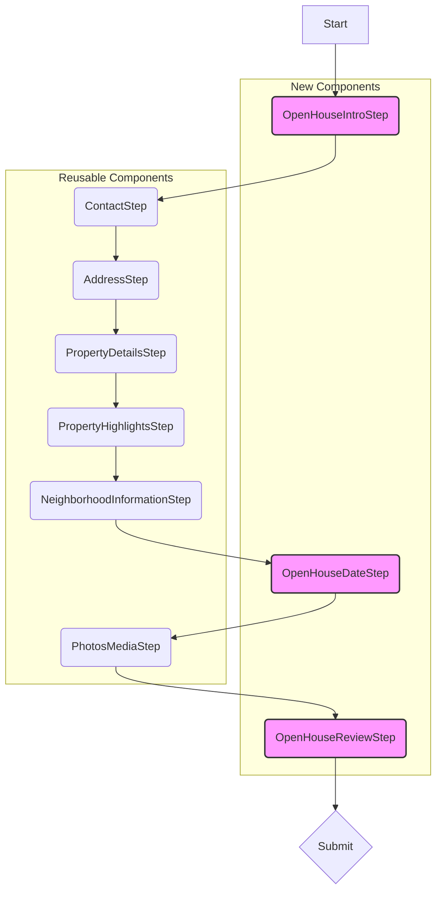

# Open House Form Creation Plan

This plan outlines the steps required to create the new "Open House" form, leveraging the existing generic form system.

**1. Form ID:** `open-house`

**2. Purpose:**
To collect all necessary details for generating a customized Open House Funnel, including a landing page and automated follow-up communications for capturing visitor information.

**3. Form Steps & Component Strategy:**

We will reuse several existing components and create new ones where necessary.



*   **Step 1: Intro (`OpenHouseIntroStep`)** - **New Component**. Will follow `FORM_INTRO_STEP_GUIDELINES.md`. Needs specific text for the Open House purpose.
*   **Step 2: Contact (`ContactStep`)** - **Reusable**. Component ID: `ContactStep`.
*   **Step 3: Address (`AddressStep`)** - **Reusable**. Component ID: `AddressStep`.
*   **Step 4: Property Details (`PropertyDetailsStep`)** - **Reusable**. Component ID: `PropertyDetailsStep`.
*   **Step 5: Property Highlights (`PropertyHighlightsStep`)** - **Reusable**. Component ID: `PropertyHighlightsStep`.
*   **Step 6: Neighborhood Info (`NeighborhoodInformationStep`)** - **Reusable**. Component ID: `NeighborhoodInfoStep`.
*   **Step 7: Date & Time (`OpenHouseDateStep`)** - **New Component**. This is the custom step.
    *   **UI:** Needs input fields for Date (date picker), Start Time (time input), and End Time (time input).
    *   **Functionality:** Needs an "Add another date/time" button to allow users to input multiple open house slots. Data should be stored as an array.
*   **Step 8: Photos & Media (`PhotosMediaStep`)** - **Reusable**. Component ID: `PhotosMediaStep`. Per your request, this will be exactly like the listing ad version (min 4 photos, draggable order).
*   **Step 9: Review & Submit (`OpenHouseReviewStep`)** - **New Component**. Needs to display a summary of all data entered in the previous steps for final confirmation. Will follow general structure but display data specific to `OpenHouseFormData`.

**4. Data Structure (`OpenHouseFormData`):**

A TypeScript interface will be defined to hold the form's data:

```typescript
// Represents a single date/time slot for the open house
interface OpenHouseDateEntry {
  id: string; // Unique ID for list rendering/management
  date: string; // Format: YYYY-MM-DD
  startTime: string; // Format: HH:MM (24-hour)
  endTime: string; // Format: HH:MM (24-hour)
}

// Main data structure for the entire form
interface OpenHouseFormData {
  contact: { // From ContactStep
    firstName: string;
    lastName: string;
    email: string;
    phone?: string;
  };
  address: { // From AddressStep
    street: string;
    city: string;
    province: string;
    postalCode: string;
    country: string;
  };
  propertyDetails: { // From PropertyDetailsStep (Subset relevant to OH)
    propertyType: string;
    bedrooms: number | string;
    bathrooms: number | string;
    squareFootage?: number;
    yearBuilt?: number;
    // Price might not be needed here unless it's for the landing page display
    description?: string; // Property description for landing page
  };
  propertyHighlights: { // From PropertyHighlightsStep (Subset relevant to OH)
    features: string[];
    upgrades: string[];
    // Investment potential/target buyer might be less relevant for OH funnel
  };
  neighborhoodInfo: { // From NeighborhoodInfoStep (Subset relevant to OH)
    description?: string; // Neighborhood description for landing page
    nearbyAmenities?: string[];
    locationHighlights?: string;
  };
  // Data from the new custom step
  openHouseDates: OpenHouseDateEntry[];
  photosMedia: { // From PhotosMediaStep
    files: File[]; // Array of File objects
    featuredImageIndex: number; // Index of the featured image
    // We might need to store file previews/URLs if not using direct File objects
  };
}
```
*(Note: We can refine the exact fields included from reusable steps like PropertyDetails/Highlights/Neighborhood based on what's truly needed for the Open House landing page/automation).*

**5. Backend Integration:**

*   **Endpoint:** We need to define the specific API endpoint where this form data will be submitted (e.g., `/api/submit/open-house`).
*   **Payload Mapping (`mapToPayload`):** A function within the form config will transform the `OpenHouseFormData` into the exact JSON structure expected by the backend. Special attention will be needed for the `photosMedia` (how files are sent - likely using `FormData` if uploading directly) and the `openHouseDates` array.
*   **CORS:** The backend endpoint *must* be configured to accept requests from the frontend's origin.

**6. Implementation Steps (High-Level):**

*(These would be carried out in Code Mode)*

1.  Define the `OpenHouseFormData` and `OpenHouseDateEntry` interfaces (likely in `src/forms/open-house.types.ts` or the config file).
2.  Create the new React components:
    *   `src/components/OpenHouseForm/OpenHouseIntroStep.tsx`
    *   `src/components/OpenHouseForm/OpenHouseDateStep.tsx`
    *   `src/components/OpenHouseForm/OpenHouseReviewStep.tsx`
3.  Create the configuration file: `src/forms/open-house.config.ts`, defining `initialData`, `steps` array (referencing component IDs), `introComponentId`, `reviewComponentId`, `mapToPayload`, `submissionEndpoint`, etc.
4.  Update `src/forms/registries.ts` to map the new component IDs (`OpenHouseIntroStep`, `OpenHouseDateStep`, `OpenHouseReviewStep`) to their respective components.
5.  Update `src/forms/configLoader.ts` to load `open-house.config.ts` for the `open-house` form type ID.
6.  Update `src/App.tsx` to add a route for the new form (e.g., `/request/open-house`).
7.  Update `src/data/services.json` to add an entry for the "Open House Request" service, linking to the new route.

**7. Testing:**

Thorough testing will be required, covering UI rendering, navigation, data persistence, validation, the "add another date" functionality, photo uploads, review step accuracy, and successful submission to the backend.